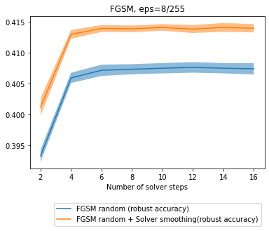

# Meta-Solver for Neural Ordinary Differential Equations
Towards robust neural ODEs using parametrized solvers.

# Main idea
Each *Runge-Kutta (RK)* solver with `s` stages and of the `p`-th order is defined by a table of coefficients (*Butcher tableau*). For `s=p=2`, `s=p=3` and `s=p=4` all coefficient in the table can be parametrized with no more than two variables [1]. 

Usually, during neural ODE training RK solver with fixed Butcher tableau is used, and only the *right-hand side (RHS)* function is trained. We propose to use the whole parametric family of RK solvers to improve robustness of neural ODEs. 

# Requirements
- pytorch==1.7
- apex==0.1 (for training)

# Examples
For CIFAR-10 and MNIST demo, please,  check  `examples` folder.

# Meta Solver Regimes
In the notebook `examples/cifar10/Evaluate model.ipynb` we show how to perform the forward pass through the Neural ODE using different types of Meta Solver regimes, namely
- Standalone
- Solver switching/smoothing
- Solver ensembling
- Model ensembling

In more details, usage of different regimes means
- **Standalone**
    - Use one solver during  inference.
    - This regime is applied in the training and testing stages.
     
    
    
- **Solver switching / smoothing**
    - For each batch one solver is chosen from a group of solvers with finite (in switching regime) or infinite (in smoothing regime) number of candidates.
    - This regime is applied in the training stage
    
    
- **Solver ensembling**
    - Use several solvers durung inference.
    - Outputs of ODE Block (obtained with different solvers) are averaged before propagating through the next layer.
    - This regime is applied in the training and testing stages.
    
    
- **Model ensembling**
    - Use several solvers durung inference.
    - Model probabilites obtained via propagation with different solvers are averaged to get the final result.
    - This regime is applied in the training and testing stages.
    
# Selected results
## Different solver parameterizations yield different robustness
We have trained a neural ODE model several times, using different ``u`` values in parametrization of the 2-nd order Runge-Kutta solver. The image below depicts robust accuracies for the MNIST classification task. We use PGD attack (eps=0.3, lr=2/255 and iters=7). The mean values of robust accuracy (bold lines) and +- standard error mean (shaded region) computed across 9 random seeds are shown in this image.

## Solver smoothing improves robustness
We compare results of neural ODE adversarial training on CIFAR-10 dataset with and without solver smoothing (using normal distribution with mean = 0 and sigma=0.0125). We choose 8-steps RK2 solver with u=0.5 for this experiment.
- We perform training using FGSM random technique described in https://arxiv.org/abs/2001.03994 (with eps=8/255, alpha=10/255). 
- We use cyclic learning rate schedule with one cycle (36 epochs, max_lr=0.1, base_lr=1e-7).
- We measure robust accuracy of resulting models after FGSM (eps=8/255) and PGD (eps=8/255, lr=2/255, iters=7) attacks.
- We use `premetanode10` architecture from `sopa/src/models/odenet_cifar10/layers.py` that has the following form 
`Conv -> PreResNet block -> ODE block -> PreResNet block -> ODE block ->  GeLU -> Average Pooling -> Fully Connected`
- We compute mean and standard error across 3 random seeds.

# References
[1] [Wanner, G., & Hairer, E. (1993). Solving ordinary differential equations I. Springer Berlin Heidelberg](https://www.springer.com/gp/book/9783540566700)
